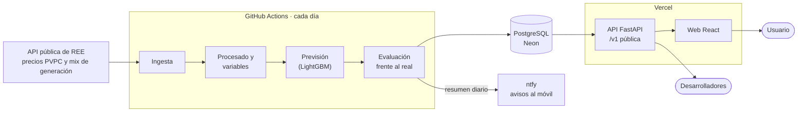

# luzPreddict


[](https://github.com/pdawgabriel-hub/luzPreddict/actions/workflows/ci.yml)


**Predicción del precio de la luz (PVPC) en España para el día siguiente, hora a hora**, con una web para consultarlo y herramientas para decidir cuándo consumir y ahorrar.

> 🚧 **Proyecto en desarrollo.** Este documento describe lo que será la aplicación; las piezas se van incorporando por fases.

---

## Qué hará

Cada tarde, cuando Red Eléctrica (REE) publica los precios del día siguiente, el sistema descarga los datos, actualiza su previsión y la publica en una web con estas secciones:

| Sección | Para qué sirve |
|---|---|
| **Panel** | Precio de ahora, de hoy y previsión de mañana; las mejores horas para consumir |
| **Histórico** | Evolución de precios, mapa de calor hora × día y diferencias entre laborables y fines de semana |
| **Mercado** | Mix de generación (eólica, solar, nuclear, gas…) y cómo influye cada tecnología en el precio |
| **Simulador** | Cuánto cuesta poner un aparato a una hora y cuánto se ahorra moviéndolo |
| **Planificador** | Reparto de varios aparatos en las horas más baratas sin superar la potencia contratada |
| **Factura** | Comparación entre el PVPC y una tarifa de precio fijo con tu consumo |
| **Alertas** | Umbral de precio personal y resumen diario de las mejores horas |
| **Modelo** | Qué tal acierta la previsión: error por hora, por día y frente a modelos de referencia |
| **API** | API pública y documentada para usar los datos en domótica o scripts propios |

---

## Cómo funciona



- **El cálculo pesado** (procesado de datos y modelo) se ejecuta en GitHub Actions; nunca llega al servidor.
- **La base de datos** guarda precios, previsiones, mix de generación, métricas y el modelo entrenado.
- **La API y la web** solo leen esos datos, así que son ligeras y se despliegan sin servidores que mantener.
- **Sin cuentas de usuario ni datos personales:** las alertas se guardan en el navegador y el resumen diario se envía por [ntfy](https://ntfy.sh).

---

## Tecnología

| Parte | Herramientas |
|---|---|
| Datos y modelo | Python, pandas, scikit-learn, LightGBM |
| Base de datos | PostgreSQL (Neon), SQLAlchemy, Alembic |
| Backend | FastAPI, Pydantic |
| Frontend | React, TypeScript, Vite |
| Automatización y despliegue | GitHub Actions, Vercel |
| Calidad | pytest, Vitest, ruff, pre-commit |

---

## Fases

### Fase 0 — Base del proyecto
- Estructura de paquetes y configuración central
- Dependencias separadas para API, pipeline y desarrollo
- Revisión de código automática (ruff) antes de cada commit
- Integración continua con GitHub Actions
- Licencia y documentación

### Fase 1 — Ingesta de datos
- Calendario: cambios de hora, festivos nacionales y tramos de la tarifa 2.0TD
- Cliente de la API de REE con reintentos y descarga por tramos
- Descarga del histórico de precios desde junio de 2021
- Descarga de la estructura de generación

### Fase 2 — Procesado y análisis
- Serie horaria limpia y continua
- Variables para predecir el día siguiente sin usar información del futuro
- Análisis exploratorio de precios y de su relación con el mix de generación

### Fase 3 — Modelo
- Modelos de referencia ("precio de ayer", "media de 7 días") y métricas
- Backtest día a día
- LightGBM con validación temporal
- Previsión del día siguiente con respaldo si el modelo falla

### Fase 4 — Base de datos
- Modelos de datos y migraciones
- Guardado de precios, previsiones, mix, métricas y modelo entrenado
- Pipeline diario que lee y escribe en PostgreSQL

### Fase 5 — Lógica de negocio
- Mejores horas, simulador de aparatos y planificador con límite de potencia
- Cálculo de factura por tramos punta, llano y valle
- Texto del resumen diario

### Fase 6 — API
- FastAPI con middlewares, errores uniformes y caché
- Endpoints públicos: precios, previsión, mejores horas, histórico y mercado
- Endpoints internos para las herramientas de la web y las métricas del modelo
- Estado del servicio y de la frescura de los datos

### Fase 7 — Frontend
- Diseño, navegación y componentes de gráficos
- Las nueve secciones de la web
- Estados de carga, error y datos desactualizados
- Modo con datos de ejemplo y tests

### Fase 8 — Automatización y despliegue
- Tarea diaria y reentrenamiento semanal en GitHub Actions
- Resumen diario y avisos de fallo por ntfy
- Despliegue de la API y la web en Vercel
- Mantenimiento de dependencias y revisión de rendimiento y accesibilidad

### Fase 9 — Mejoras (opcional)
- Límite de peticiones en la API
- Previsiones de demanda, eólica y solar como variables del modelo
- Intervalos de predicción
- Docker y soporte para Canarias, Baleares, Ceuta y Melilla

---

## Desarrollo local

Requisitos: Python 3.12.

```bash
python3 -m venv venv
make install   # dependencias y hooks de pre-commit
make lint      # revisión de código
make test      # tests
```

`make help` muestra todos los comandos disponibles.

---

## Datos y licencia

- Los datos proceden de la [API pública de Red Eléctrica (REE)](https://www.ree.es/es/apidatos).
- Las previsiones son orientativas y no garantizan el precio final.
- Código bajo licencia [MIT](LICENSE).
